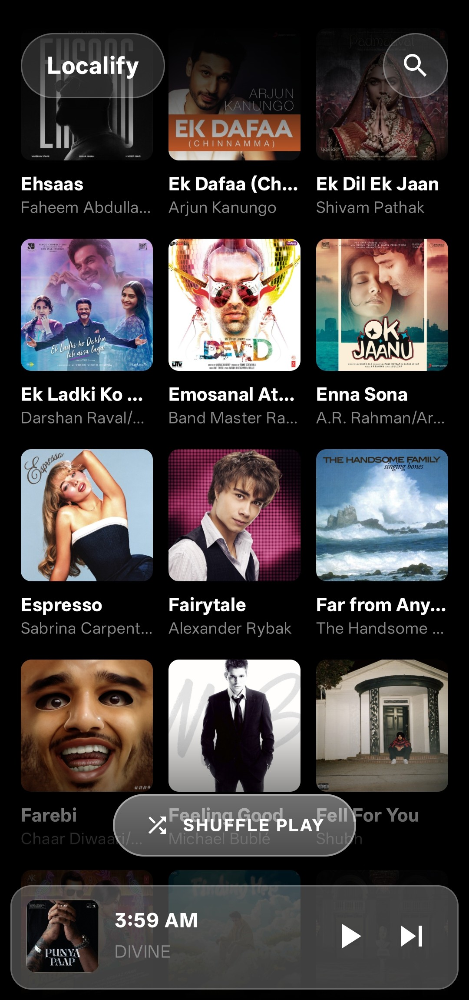
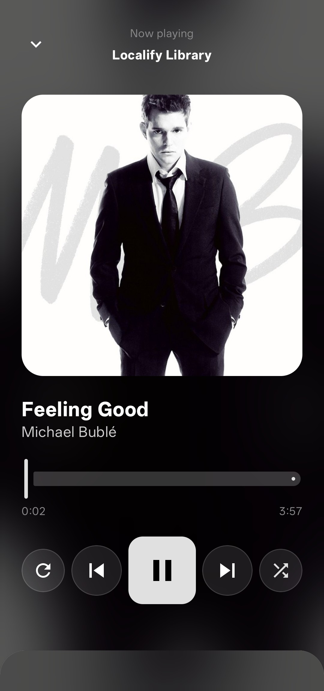
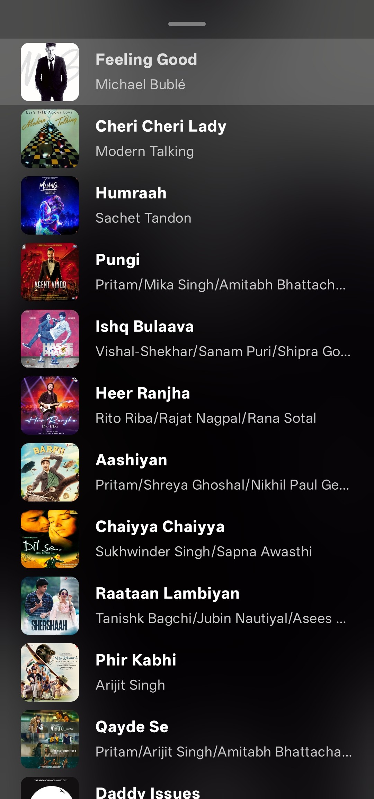

# 🎵 Localify

**Localify** is a premium, high-performance local music player for Android that blends a minimalist glassmorphism aesthetic with modern Android technologies. It prioritizes smooth animations, fast performance, and an immersive user experience powered by Media3, Jetpack Compose, and intelligent caching.

---

## ✨ Features

- 🎨 **Dynamic Theming** — The UI automatically adapts its color palette to match the artwork of the currently playing song using the **Palette API**.
- 🌫️ **Immersive Glass UI** — A beautiful "frosted glass" interface with deep Gaussian blurs and real-time crossfading backgrounds.
- ⚡ **High Performance**
  - **Room Database Cache**: Instant app startup and library loading by caching MediaStore results.
  - **Asynchronous Processing**: All scans and bitmapping run on background IO threads to ensure 60fps UI performance.
  - **Media3 (ExoPlayer)**: Robust, industry-standard audio engine for gapless playback.
- 👆 **Gesture-Driven Experience**
  - **Swipe-to-Skip**: Toss the album art left or right to change tracks with physical scaling feedback.
  - **Interactive Queue**: Smoothly slide up the queue from the bottom of the player.
- 🔍 **Smart Search** — Real-time song filtering with debounced logic for lag-free searching in large libraries.
- 🔄 **Modern Controls** — Morphing play/pause button that changes shape between a circle and a rounded square.

---

## 🛠️ Tech Stack

| Component        | Technology                        |
|------------------|-----------------------------------|
| **UI**           | Jetpack Compose                   |
| **Audio Engine** | Media3 (ExoPlayer + MediaSession) |
| **Database**     | Room (Local Cache)                |
| **Images**       | Coil                              |
| **Theming**      | Palette API                       |
| **Concurrency**  | Coroutines + Flow                 |
| **Architecture** | MVVM (Model-View-ViewModel)       |

---

## 📸 Screenshots

|             Home Library             |                 Now Playing                 |        Interactive Queue        |
|:------------------------------------:|:-------------------------------------------:|:-------------------------------:|
|  |  |  |

---

## 🚀 Getting Started

### Prerequisites

- Android Studio (Ladybug or newer)
- Android SDK 29+

### Installation

1. **Clone the repository:**
   ```bash
   git clone https://github.com/Priyanshu10Anand/localify.git
   cd localify
   ```

2. **Open in Android Studio:**
   - Launch Android Studio and select "Open an existing project"
   - Navigate to the cloned directory and open it

3. **Run the app:**
   - Connect your device or use an emulator
   - Click the "Run" button or press `Shift + F10`
   - Grant **Music & Audio** permissions when prompted to see your local files.

### 📦 Download APK
You can download the latest stable version of Localify from the [Releases](https://github.com/Priyanshu10Anand/localify/releases) section of this repository.

1. Go to the **Releases** tab on the right sidebar.
2. Download the `Localify_v1.0.0.apk` (or latest version) file.
3. Install it on your Android device (you may need to enable "Install from Unknown Sources").

---

## 📋 Permissions

The app requires the following permissions to function:
- `READ_MEDIA_AUDIO` / `READ_EXTERNAL_STORAGE` — To access your music library.
- `FOREGROUND_SERVICE` — To keep music playing when the app is in the background.
- `POST_NOTIFICATIONS` — To show playback controls in the notification bar.

---

<div align="center">
  <p>Developed with ❤️ by <strong>Priyanshu</strong></p>
</div>
